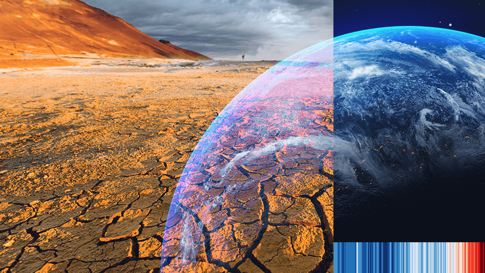

# Project-3: Algorithm Alchemists

## **Climate Insights: Unveiling Ocean-Sea Dynamics, Pandemic Pollution, and Urban Air Trends**

### Description:
This data analytics project delves into the relationship between ocean temperatures and sea level rise across the past century, shedding light on potential correlations. Additionally, it investigates the impact of COVID-19 lockdowns on regional air pollution levels, pinpointing the top 5 cities that experienced the most substantial air quality improvements. Furthermore, the project identifies and maps cities worldwide that have witnessed a concerning 10% or greater increase in air pollution over the last century, providing crucial insights into long-term urban air quality trends.

### Project Proposal Link: 
https://docs.google.com/spreadsheets/d/1hUXEQ61Uu3qKjET-FD_D_D6WSRBqtRVKcPqp_mbfrdI/edit?usp=sharing
